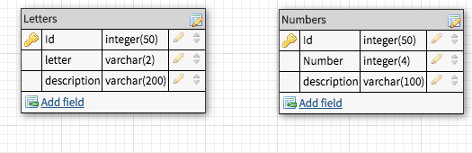

# MVP Goals:
- Home View
- Navigation Bar
- Alphabet View
- Create go forward and back buttons for alphabet view
- Numbers View
- Create forward and back buttons for number view 
- Bootstrap
-shoelace for formatting divs 

# Stretch Goals: 
- Angular Material 
- Voice when a number or letter is clicked on 
- Color View
- Shape View 
-  Landing view for each nav option to allow a user to select a certain letter, number, color, or shape. 

# ERD 
